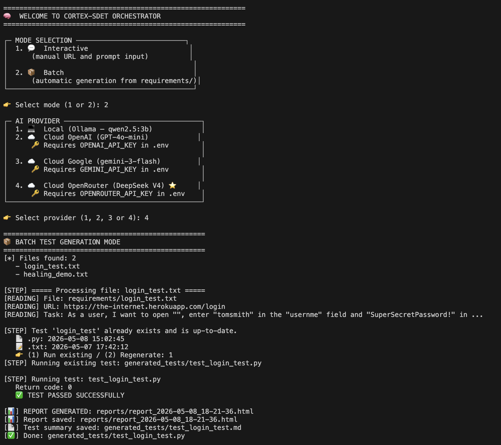
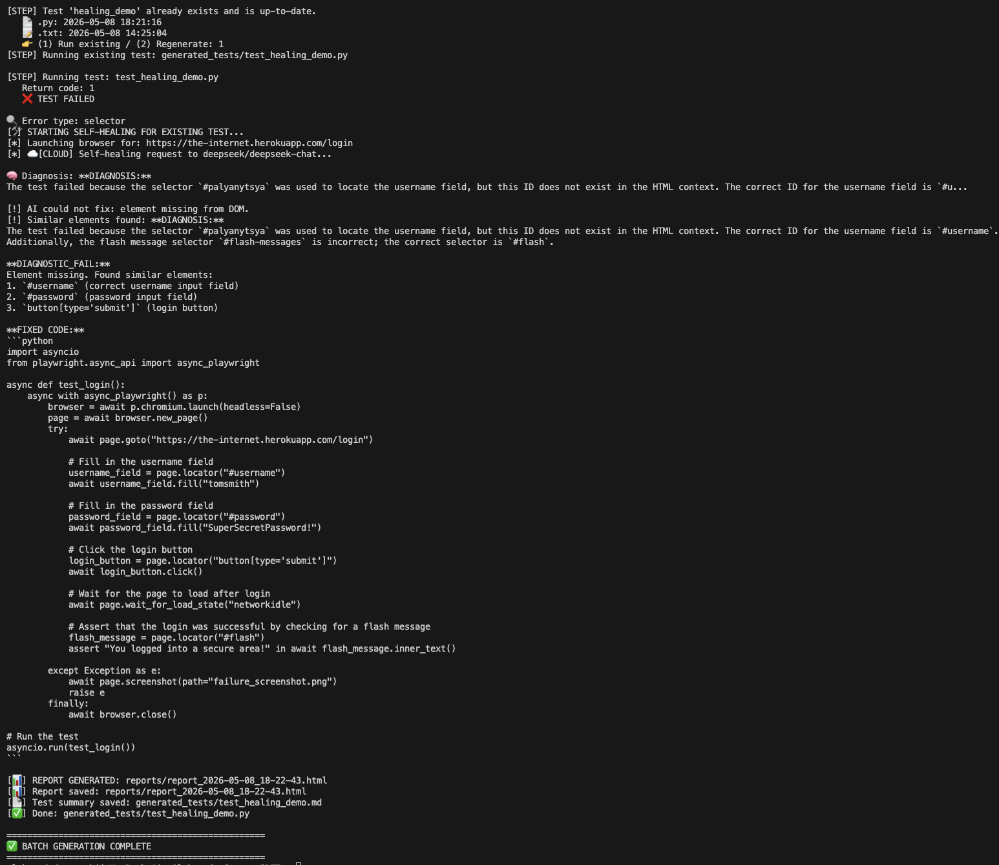
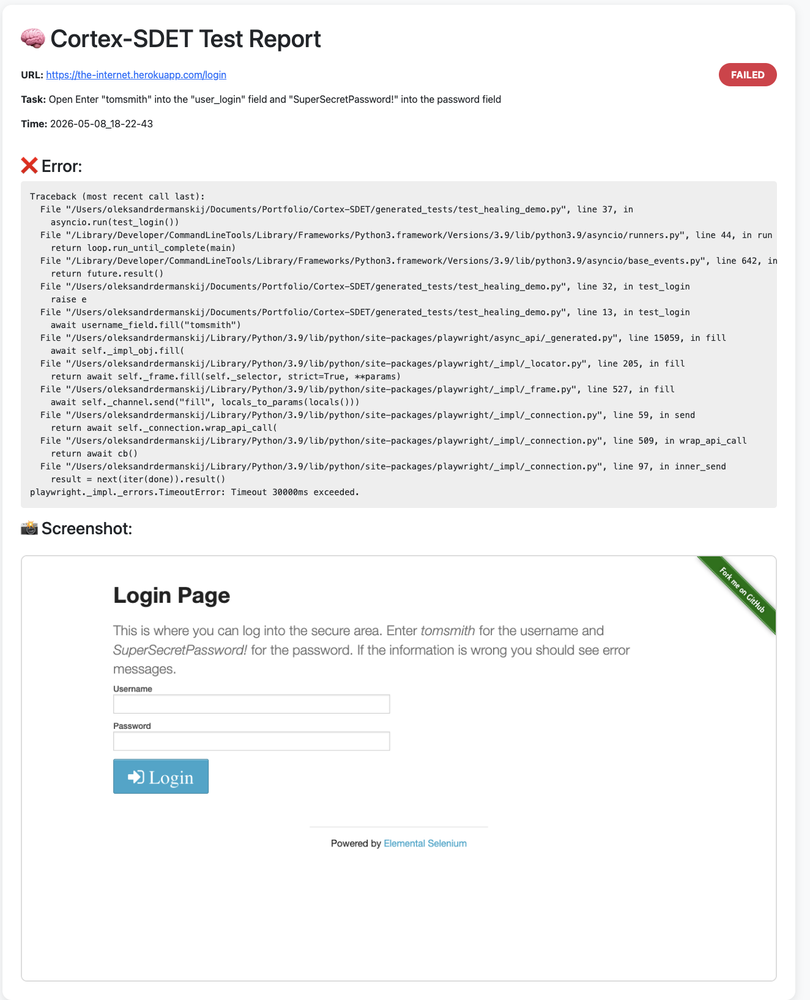

# 🧠 Cortex-SDET Orchestrator

[](https://github.com/Alexander0108/Cortex-SDET/actions/workflows/test.yml)

**Autonomous AI-Powered E2E Testing Framework**  
**REST API Testing · SQL Database Testing · Data Format Validation · Data-Driven Testing**

Cortex-SDET is a professional-grade QA Automation orchestrator that leverages Large Language Models (LLMs) to generate, execute, and self-heal end-to-end Playwright tests in real-time. It transforms natural-language test descriptions into executable code, dramatically reducing test maintenance costs and eliminating flaky tests.

Beyond UI testing, Cortex-SDET includes comprehensive **REST API testing** (PetStore, JSON Schema, Swagger) and **SQL database testing** (SELECT, JOIN, UPDATE, data formats) modules, demonstrating full-spectrum QA engineering skills.

---

## 📈 Value Proposition & ROI

| Problem                                                       | Cortex-SDET Solution                                                                            | Impact                                          |
| ------------------------------------------------------------- | ----------------------------------------------------------------------------------------------- | ----------------------------------------------- |
| **Flaky tests** consume 40%+ of QA engineering time           | Autonomous self-healing engine detects DOM changes and patches selectors automatically          | ~80% reduction in test maintenance              |
| **Test creation** requires deep Playwright/Selenium expertise | Intent-based testing: describe business logic in plain language                                 | Non-technical stakeholders can contribute tests |
| **Multi-environment** complexity (local vs cloud)             | Hybrid Brain seamlessly switches between Local (Ollama), OpenAI, Google Gemini, and DeepSeek V4 | Zero-config provider switching                  |
| **API rate limits** & server overloads                        | Integrated retry logic with exponential backoff (HTTP 429/503)                                  | Resilient CI/CD pipelines                       |
| **Debugging overhead**                                        | Bootstrap-based HTML reports with failure screenshots, DOM snapshots, and AI diagnosis          | Stakeholder-ready visibility                    |

---

## ✨ Key Features

### 🤖 Multi-LLM Support

Choose your intelligence layer based on speed, cost, and privacy requirements:

| Provider           | Model          | Best For                                          |
| ------------------ | -------------- | ------------------------------------------------- |
| **OpenAI**         | GPT-4o-mini    | High-speed precision, complex logic generation    |
| **Google**         | Gemini 3 Flash | Fault tolerance, auto-recovery under load         |
| **OpenRouter**     | DeepSeek V4 ⭐ | Best price/performance ratio for batch generation |
| **Local (Ollama)** | Qwen 2.5:3b    | Zero-cost privacy, 100% offline on Apple Silicon  |

### 🧠 Smart Error Classification

The system intelligently classifies test failures:

- **Selector Errors** (`NoSuchElementException`, `TimeoutError`): Full self-healing cycle — DOM analysis → AI repair → code patch → retry
- **Assertion Errors** (`AssertionError`): Logged as application bugs. Test code is **never** modified — the bug is in the app, not the test
- **Unknown Errors**: Best-effort repair attempt with full diagnostic output

### 🛠 Self-Healing Engine

When a locator changes or an element goes missing:

1. **Intercept**: Catch the crash with full Traceback
2. **Diagnose**: AI analyzes the DOM state and error message
3. **Suggest alternatives**: If the exact element is missing, the AI finds 2-3 similar interactive elements (other inputs, buttons, etc.)
4. **Show diff (Human-in-the-Loop)**: The system displays a compact `BEFORE → AFTER` code diff (🔴 removed / 🟢 added lines) so you see **exactly** what AI wants to change
5. **Confirm**: You approve (`y`) or reject (`n`) the fix — AI never silently rewrites your tests
6. **Patch & Retry**: Apply the fix, re-execute the test
7. **Report**: Generate a detailed report with `"FIXED BY AI"` status

Every HTML report that involved a repair now includes a dedicated **🛠️ Self-Healing Execution Log** section showing:
- 🧠 **AI Diagnosis** — what was found (e.g. *"Old locator `#old_btn` was removed from DOM"*)
- 🔧 **Action taken** — how it was fixed (e.g. *"Replaced with `get_by_role(button, name=\"Log in\")`. Test re-ran and passed."*)

> 🔒 **Safety by design**: Batch mode also asks for confirmation before applying an AI patch. The user stays in control of every code change.

### 📦 Batch Mode

Process multiple test requirements in a single run:

1. Place `.txt` files in `requirements/` with natural-language descriptions
2. **Important:** each `.txt` file must contain an `http(s)://` link to the target page (e.g. `"Open https://site.com and login"`). Files without a URL are skipped with a hint
3. The orchestrator extracts URLs via regex and generates Playwright tests
4. **Smart Skip**: Compares file timestamps — if the `.py` test is newer than the `.txt` requirement, it asks: _"(1) Run existing / (2) Regenerate"_
5. Each test generates:
   - `generated_tests/test_[name].py` — executable Playwright test
   - `generated_tests/test_[name].md` — Markdown summary with status, model, errors, and self-healing details
   - `reports/report_[timestamp].html` — professional HTML report

---

## 🔌 API Testing Module

REST API testing against the [PetStore](https://petstore.swagger.io) demo API, demonstrating full CRUD operations, JSON Schema validation, and Swagger/OpenAPI compliance. See `api_tests/` directory.

### Interactive CLI Demo

```bash
python3 api_tests/api_cli.py
```

A user-friendly menu-driven interface for demonstrating API testing interactively:

```
┌────────────────────────────────────────────────────────────────┐
│ 🧠 CORTEX-SDET API TESTING CLI                                  │
│ REST API Testing - PetStore Demo                                │
│                                                                 │
│ ACTIONS:                                                        │
│ 1. 📦 GET - List pets by status                                 │
│ 2. 🔍 GET - Get pet by ID                                       │
│ 3. 💾 POST - Create a new pet                                   │
│ 4. 🔧 PUT - Update an existing pet                              │
│ 5. ⛔ DELETE - Delete a pet                                     │
│                                                                 │
│ 6. 📋 JSON Schema Validation                                    │
│ 7. 📖 Swagger / OpenAPI Spec                                    │
│                                                                 │
│ 8. 🏃 Run All API Tests (pytest)                                │
│ 0. ❌ Exit                                                      │
└────────────────────────────────────────────────────────────────┘
```

### pytest Suite

```bash
pytest api_tests/ -v
```

| Test File             | Covers                                                                                       | Requirements Matched                                               |
| --------------------- | -------------------------------------------------------------------------------------------- | ------------------------------------------------------------------ |
| `test_petstore.py`    | GET, POST, PUT, DELETE, status codes, headers, error handling, edge cases                    | Restful API testing, HTTP(S) protocols, client-server architecture |
| `test_json_schema.py` | JSON Schema validation, required fields, data types, nested objects, Swagger spec validation | JSON Schema, Swagger Schema, OpenAPI                               |
| `test_auth.py`        | Public/private endpoints, SQL injection attempts, XSS, invalid API keys, HTTP methods        | Security testing, API authentication patterns                      |

### Skills Demonstrated

> "I perform REST API testing using the PetStore demo API — a standard industry example with full Swagger documentation. My tests cover the complete CRUD cycle (GET, POST, PUT, DELETE), validate JSON Schema contracts, verify response headers and status codes, and test edge cases like invalid IDs and missing fields. The Swagger/OpenAPI spec validation confirms I understand API documentation standards."

---

## 🗄️ SQL Testing Module

Database testing with SQLite, demonstrating SQL queries, data manipulation, and format validation. See `sql_tests/` directory. No external database setup required — everything runs in-memory.

### Interactive CLI Demo

```bash
python3 sql_tests/sql_cli.py
```

A menu-driven interface for demonstrating SQL queries interactively:

```
┌────────────────────────────────────────────────────────────────┐
│ 📁 CORTEX-SDET SQL TESTING CLI                                  │
│ Database Testing - SQLite Demo                                  │
│                                                                 │
│ SELECT QUERIES:                                                 │
│ 1. 📊 SELECT - Get all users                                    │
│ 2. 🔍 SELECT - Filter users by status                           │
│                                                                 │
│ JOINS:                                                          │
│ 3. 🔗 INNER JOIN - Users with their orders                      │
│ 4. 🔗 LEFT JOIN - All users (even without orders)               │
│                                                                 │
│ DATA MODIFICATION:                                              │
│ 5. 🔧 UPDATE - Change user status                               │
│ 6. 💾 INSERT - Add a new user                                   │
│ 7. ⛔ DELETE - Remove a user                                    │
│                                                                 │
│ AGGREGATION & SPECIAL:                                          │
│ 8. 📈 GROUP BY - Top spenders                                   │
│ 9. 📋 JSON Data - Preferences in database                        │
│ 10. 📝 Custom SQL - Run any query                               │
│                                                                 │
│ 11. 🏃 Run All SQL Tests (pytest)                               │
│ 0. ❌ Exit                                                      │
└────────────────────────────────────────────────────────────────┘
```

### pytest Suite

```bash
pytest sql_tests/ -v
```

| Test File              | Covers                                                                                              | Requirements Matched                                           |
| ---------------------- | --------------------------------------------------------------------------------------------------- | -------------------------------------------------------------- |
| `test_database.py`     | SELECT, JOIN (INNER/LEFT), UPDATE, INSERT, DELETE, GROUP BY, ORDER BY, subqueries, JSON in database | SQL queries (SELECT, JOIN, UPDATE), client-server architecture |
| `test_data_formats.py` | JSON parsing & validation, CSV parsing & validation, XML parsing, cross-format conversion           | Test data formats (JSON, CSV, XML), data validation            |

### SQL Tables Structure

The test database simulates a real e-commerce application:

```
users (id, name, email, status, created_at)
  ↓
orders (id, user_id, product, quantity, total, order_date)  [FK → users]
  ↓
user_preferences (user_id, preferences JSON)                [FK → users]
products (id, name, price, category, stock)                  [standalone]
```

### Skills Demonstrated

> "I use SQLite for database testing — it requires zero setup and runs in-memory, making tests fast and isolated. My test suite covers all major SQL operations: SELECT with filtering, INNER and LEFT JOINs for relational data, UPDATE for data modification, INSERT/DELETE for CRUD, GROUP BY for aggregations, and subqueries. I also validate JSON data stored in database columns. The sample schema mirrors a real e-commerce system with users, orders, and products."

---

## 📊 Data-Driven Testing Module

Parameterized tests that load test scenarios from external CSV and JSON files. Demonstrates separation of test data from test logic — a key QA engineering practice. See `data_driven_tests/` and `data/` directories.

### Interactive CLI Demo

```bash
python3 data_driven_tests/data_cli.py
```

A menu-driven interface for viewing test data and running validations:

```
┌─ ACTIONS ──────────────────────────────────────┐
│  1. 📄  Show CSV test data (users)             │
│  2. 📄  Show JSON test data (products)         │
│  3. 🏃  Run CSV data-driven tests (pytest)     │
│  4. 🏃  Run JSON data-driven tests (pytest)    │
│  5. 🏃  Run ALL data-driven tests (pytest)     │
└─────────────────────────────────────────────────┘
```

### pytest Suite

```bash
pytest data_driven_tests/ -v
```

| Test File             | Covers                                                                       | Requirements Matched                                  |
| --------------------- | ---------------------------------------------------------------------------- | ----------------------------------------------------- |
| `test_csv_reader.py`  | CSV data loading, `@pytest.mark.parametrize`, email/password/role validation | Test data formats (CSV), data-driven testing patterns |
| `test_json_reader.py` | JSON data loading, product validation (price, stock, name, category)         | Test data formats (JSON), data validation             |

### Test Data Files

| File                      | Contents                                         | Includes Invalid Data?               |
| ------------------------- | ------------------------------------------------ | ------------------------------------ |
| `data/test_users.csv`     | 7 user scenarios (email, password, role, status) | Yes (short passwords, invalid roles) |
| `data/test_products.json` | 6 products (id, name, price, stock, category)    | Yes (negative price, empty name)     |

### Skills Demonstrated

> "I follow the data-driven testing approach — test data is stored separately from test logic in CSV and JSON files. This allows non-technical team members to add test scenarios without modifying code. Tests use `@pytest.mark.parametrize` to iterate over each data row, and failed validations produce descriptive error messages showing exactly which field failed and why."

### CI/CD Behavior

The `test_user_validation` and `test_product_validation` tests include intentionally
invalid data (short passwords, negative prices, empty names) to demonstrate how the
validation engine catches bad inputs. These are **excluded from CI** via
`-k "not user_validation and not product_validation"` to keep the build badge
green. The integrity checks (`test_csv_data_integrity`, `test_json_data_integrity`)
still run in CI to verify file structure correctness.

> **API and SQL tests** have no intentionally failing cases — all their assertions
> are expected to pass, ensuring the CI badge reflects actual infrastructure health.

---

## 📊 Provider Benchmarks

| Provider                        | Status    | Highlighted Capability                                                             |
| ------------------------------- | --------- | ---------------------------------------------------------------------------------- |
| **OpenAI (GPT-4o-mini)**        | ✅ Passed | **High-Speed Precision:** Optimal for complex logic generation with lowest latency |
| **Google (Gemini 3 Flash)**     | ✅ Passed | **Fault Tolerance:** Demonstrated auto-recovery during API 503 unavailability      |
| **OpenRouter (DeepSeek V4) ⭐** | ✅ Passed | **Recommended Cloud:** Best price/performance ratio for batch generation           |
| **Local (Qwen 2.5:3b)**         | ✅ Passed | **Zero-Cost Privacy:** 100% offline execution optimized for Apple Silicon (M2)     |

---

## 🖼️ Visual Overview

### 1. Main Menu & Multi-LLM Provider Selection



> The structured CLI interface (English-only) presents two distinct selection blocks — **Mode** (Interactive vs. Batch) and **AI Provider** (Local Ollama, OpenAI GPT-4o-mini, Google Gemini 3 Flash, or OpenRouter DeepSeek V4). In this example, **DeepSeek V4** is selected, followed by a successful `login_test` execution demonstrating seamless batch processing.

### 2. AI Self-Healing & Smart Error Classification



> When a test fails, the orchestrator automatically classifies the error type (Selector vs. Assertion), analyzes the DOM state, and applies an autonomous fix. The terminal output shows the full healing cycle: error detection → `🔍 Error type: selector` → `🧠 Diagnosis` (identifying that `#palyanytsya` is missing and the correct selector is `#username`) → `✨ AI FIX APPLIED` → test retry → `✅ TEST PASSED SUCCESSFULLY`. This eliminates flaky tests and reduces maintenance overhead by approximately 80%.

### 3. Professional HTML Report & Markdown Summary



> A high-fidelity Bootstrap-based report featuring a red **FAILED** badge, a full Python traceback of a `TimeoutError`, and a **Failure Screenshot** section capturing the actual web page at the moment of failure. Each test execution generates this stakeholder-ready HTML artifact along with a Markdown summary (`test_[name].md`) providing test status, AI model used, error details, and self-healing history — enabling rapid audit and traceability for QA leadership.

---

## 🛠 Tech Stack

- **Core**: Python 3.9+, AsyncIO
- **Browser Automation**: Playwright (Async API)
- **DOM Processing**: Custom BeautifulSoup4 Sanitizer (optimizes LLM token consumption)
- **Intelligence**: Google GenAI SDK, OpenAI API, OpenRouter API, Ollama (Local Models)
- **API Testing**: `requests`, `jsonschema` (JSON Schema validation, Swagger/OpenAPI)
- **Database Testing**: SQLite3 (built-in), in-memory database (zero-config, fast)
- **Data Formats**: JSON, CSV, XML (built-in Python modules)
- **Optimization**: Apple Silicon (M2) native support for local LLM inference

---

## 🚀 Quick Start

### Prerequisites

```bash
pip install -r requirements.txt
playwright install
```

### Environment Setup

Create a `.env` file in the project root:

```env
OPENAI_API_KEY=your_openai_key
GEMINI_API_KEY=your_gemini_key
OPENROUTER_API_KEY=your_openrouter_key
```

### Local LLM (Optional)

```bash
ollama pull qwen2.5:3b
```

### Run the Unified Control Center (single entry point for ALL modules)

```bash
python3 main.py
```

The master hub replaces the old separate CLI entry points:

1. **Language selection** — the chosen language localizes the **entire interface** (menu, hints, Quick Guide) and AI answers:
   - 🇺🇦 **Українська** (professional terms, error codes and code stay in English)
   - 🇬🇧 **English**
2. **Mode**: AI Interactive (manual) or AI Batch (automatic from `requirements/`)
3. **Provider**: Local (Qwen), OpenAI, Google Gemini, or OpenRouter (DeepSeek V4)

The hub then gives you one localized menu with every module and short hints:

```text
┌────────────────────────────────────────────────────────────────────────┐
│ 🤖 AI AGENTIC TESTING                                                  │
│ 1. 💬 Interactive UI Generator                                         │
│    └─ build a Playwright test from URL + Self-Healing                  │
│ 2. 📦 Batch Test Generator                                             │
│    └─ auto-generate & run tests from requirements/                     │
│ 🔌 TESTING SUITES                                                      │
│ 3. 🌐 REST API Testing                                                 │
│    └─ PetStore CRUD, JSON Schema & API security checks                 │
│ 4. 📁 SQL DB & Data Formats                                            │
│    └─ SQLite queries (JOIN/GROUP BY) & JSON/CSV/XML validation         │
│ 5. 📊 Data-Driven Testing                                              │
│    └─ business rule validation for users/products from CSV/JSON        │
│ 🚀 ALL-IN-ONE & REPORTING                                              │
│ 6. ⚡ Run FULL Test Suite                                              │
│    └─ run all 67 tests at once (API + SQL + Data-Driven)               │
│ 7. 📑 Generate Unified Dashboard                                       │
│    └─ HTML index of all reports, screenshots & AI summaries            │
│ 📖 INFO                                                                │
│ 8. 💡 About / Quick Guide                                              │
│    └─ quick overview: what it is, where data comes from, how it works  │
│ 0. ❌ Exit                                                             │
└────────────────────────────────────────────────────────────────────────┘
```

- Options 3-5 launch the module CLIs **inside** the hub — you return to the menu automatically when they finish.
- Option **8** prints a compact bilingual guide: where tests & data come from, what the 6 expected DDT failures mean, and how Self-Healing works.

### Run modules directly (alternative)

Each module still works standalone:

```bash
python3 api_tests/api_cli.py            # API testing CLI
python3 sql_tests/sql_cli.py            # SQL testing CLI
python3 data_driven_tests/data_cli.py   # Data-Driven testing CLI
```

### Run API Tests (pytest Suite)

```bash
pytest api_tests/ -v
```

### Run SQL Tests (pytest Suite)

```bash
pytest sql_tests/ -v
```

### Run All Tests

```bash
pytest api_tests/ sql_tests/ data_driven_tests/ -v -k "not user_validation and not product_validation"
```

---

## 🧠 Core Architecture

### CortexScraper

Cleans raw HTML, stripping scripts and CSS to provide LLMs with a structured, token-efficient DOM tree. Optimized to reduce token consumption by ~60% compared to raw HTML.

### CortexBridge

The intelligence layer that translates natural-language intent into executable Playwright Python code. Supports four providers with automatic failover and retry logic.

### CortexReporter

Aggregates test metadata (URL, task, status, error, screenshot) and constructs professional Bootstrap-based HTML artifacts for stakeholder visibility.

---

## 🧠 Redis Knowledge (Conceptual)

While Cortex-SDET does not currently include a live Redis module (as Redis requires a running server), this section demonstrates understanding of how Redis is used in modern web applications and how a QA engineer would test Redis-dependent functionality.

### What is Redis?

Redis is an in-memory data store used for:

- **Caching** — store frequently accessed data (user sessions, API responses, database query results)
- **Session Management** — store user login sessions (stateless servers)
- **Message Queues** — task processing (e.g., email sending, image processing)
- **Rate Limiting** — track API request counts per user
- **Real-time Data** — leaderboards, online status, counters

### How I Would Test Redis in an Application

#### 1. Caching Layer Testing

```python
# Scenario: User profile is cached after first request
# 1. Request user profile → verify it's cached in Redis
# 2. Update user profile in database → verify cache is invalidated
# 3. Request profile again → verify fresh data is returned

redis_client.get(f"user:{user_id}:profile")  # Should exist after first GET
redis_client.delete(f"user:{user_id}:profile")  # After UPDATE
redis_client.get(f"user:{user_id}:profile")  # Should be None (cache cleared)
```

#### 2. Session Expiry Testing

```python
# Scenario: User session expires after TTL
# 1. Login → Redis stores session with TTL (e.g., 3600s)
# 2. Verify session exists: redis_client.exists(session_key) == True
# 3. Wait for TTL or manually expire
# 4. Verify session is gone: redis_client.exists(session_key) == False
# 5. Verify user is redirected to login page
```

#### 3. Rate Limiting Testing

```python
# Scenario: API rate limit is enforced
# 1. Make N requests (where N = rate limit)
# 2. All should return 200 OK
# 3. Make N+1 request
# 4. Should return 429 Too Many Requests
# 5. Verify Redis counter: redis_client.get(f"ratelimit:{user_id}") == N+1
```

#### 4. Message Queue Testing

```python
# Scenario: Background task is queued and processed
# 1. Trigger action (e.g., "send email")
# 2. Verify task appears in Redis list: redis_client.llen("email:queue") == 1
# 3. Wait for worker to process
# 4. Verify task is removed: redis_client.llen("email:queue") == 0
# 5. Verify email was sent (check database/email service)
```

#### 5. Integration with API/UI Testing

```python
# Complete scenario combining API + Redis + Database:
# 1. POST /api/login → verify session is created in Redis
# 2. GET /api/profile → verify response is fast (cached)
# 3. PUT /api/profile → verify cache is invalidated
# 4. GET /api/profile again → verify fresh data
# 5. Verify session expiry → user gets 401 on subsequent requests
```

### Testing Tools for Redis

- **redis-py** (`pip install redis`) — Python client for Redis
- **Fakeredis** (`pip install fakeredis`) — In-memory Redis mock for testing (no server needed)
- **Docker** — Run Redis locally: `docker run -p 6379:6379 redis`

### Why This Matters for QA

Redis adds a layer of complexity between the client and database. A QA engineer must:

- Understand what data is cached and when it's invalidated
- Test that caching improves response times without serving stale data
- Verify that session expiry and rate limiting work correctly
- Ensure that cache failures don't break the application (graceful degradation)

---

## 🧩 Repository Structure

```
Cortex-SDET/
├── main.py                    # Orchestrator: CLI, Batch Mode, Smart Skip, Self-Healing
├── bridge.py                  # AI Bridge: Multi-LLM support (OpenAI, Gemini, DeepSeek, Ollama)
├── reporter.py                # HTML report generator
├── scraper.py                 # DOM sanitizer and HTML cleaner
├── requirements.txt           # Python dependencies
├── README.md                  # This file
│
├── api_tests/                 # 🔌 API Testing Module (REST API, JSON Schema, Swagger)
│   ├── api_cli.py             # Interactive CLI for API testing demonstrations
│   ├── test_petstore.py       # CRUD tests for PetStore API (GET, POST, PUT, DELETE)
│   ├── test_json_schema.py    # JSON Schema validation + Swagger spec compliance
│   └── test_auth.py           # Authentication, security edge cases, SQL injection, XSS
│
├── sql_tests/                 # 🗄️ SQL Testing Module (SQLite, data formats)
│   ├── sql_cli.py             # Interactive CLI for SQL query demonstrations
│   ├── test_database.py       # SELECT, JOIN, UPDATE, INSERT, DELETE, GROUP BY, subqueries
│   └── test_data_formats.py   # JSON, CSV, XML parsing, validation, cross-format conversion
│
├── data_driven_tests/         # 📊 Data-Driven Testing Module (CSV/JSON parameterized tests)
│   ├── data_cli.py            # Interactive CLI for data-driven test demonstrations
│   ├── test_csv_reader.py     # Parameterized tests from CSV data
│   └── test_json_reader.py    # Parameterized tests from JSON data
│
├── data/                      # 📁 Test data files (CSV, JSON)
│   ├── test_users.csv         # User test scenarios
│   └── test_products.json     # Product test data with valid/invalid records
│
├── requirements/              # Input: .txt files with test descriptions
├── generated_tests/           # Output: generated .py tests + .md summaries
├── reports/                   # Output: professional HTML reports
├── assets/                    # Screenshots for documentation
├── .github/workflows/         # 🚀 CI/CD: GitHub Actions automation
│   └── test.yml               # Automated test pipeline (push/PR → pytest)
└── requirements.txt
```

---

## 📋 Requirements Coverage Map

| Requirement                          | How Cortex-SDET Covers It                                         | File(s)                                              |
| ------------------------------------ | ----------------------------------------------------------------- | ---------------------------------------------------- |
| AI-powered tools for test automation | LLM-based test generation, self-healing, multi-provider support   | `main.py`, `bridge.py`                               |
| Restful API testing (no UI)          | CRUD operations against PetStore REST API                         | `api_tests/test_petstore.py`, `api_tests/api_cli.py` |
| Swagger, JSON Schema                 | JSON Schema validation, Swagger spec fetching & validation        | `api_tests/test_json_schema.py`                      |
| SQL queries (SELECT, JOIN, UPDATE)   | Full SQL test suite with SQLite                                   | `sql_tests/test_database.py`, `sql_tests/sql_cli.py` |
| Test data formats (JSON, CSV, XML)   | Parsing, validation, conversion between formats                   | `sql_tests/test_data_formats.py`                     |
| Python                               | Entire framework written in Python 3.9+                           | All files                                            |
| Client-server architecture           | API module (client → server), SQL module (application → database) | `api_tests/`, `sql_tests/`                           |
| HTTP(S) protocols                    | REST API testing with status codes, headers, methods              | `api_tests/test_petstore.py`                         |
| Redis knowledge                      | Conceptual documentation with testing scenarios                   | `README.md` — Redis Knowledge section                |
| Data-driven testing (CSV, JSON)      | Parameterized tests with external data files                      | `data_driven_tests/`, `data/`                        |
| CI/CD automation                     | GitHub Actions pipeline — auto-runs tests on push/PR              | `.github/workflows/test.yml`                         |
| Functional, regression, GUI testing  | AI-powered Playwright tests + self-healing                        | `main.py` (core orchestrator)                        |

---

_Designed and engineered by Oleksandr Dermanskij — AQA Engineer & AI Automation Specialist_
